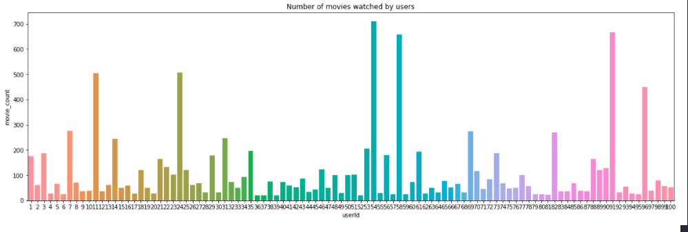
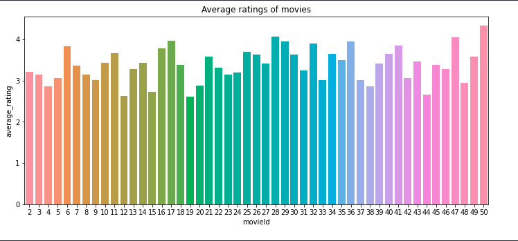

# **Movie Recommended System**

## **Explore the data** 

    
 Number of movies watched by users
    

    
 Average ratings by users
    

## **Content-based Recommendation Method** 

**For content-based method, we used 'tag' as the main feature and aim to find the most relevant 'tag' and extract the features of the tag content. There are clean tags with relevancy scoring. That makes it easier to get the most relevant tags for the movie.**

    
    
    

## **Collaborative Filtering Recommendation Method** 

**For collaborative filtering (CF), we used the rating of the movie given by each user to find the similarity between the two users. We just use similarity-based on to calculate how similar the user interests are. The higher the similarity score, the more the user profiles are closed.**

    
    

# **References**
- Inspire by **Kaylode**: https://github.com/kaylode/rec-sys